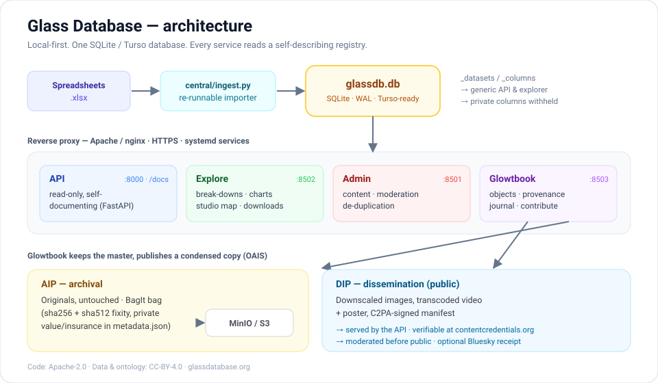
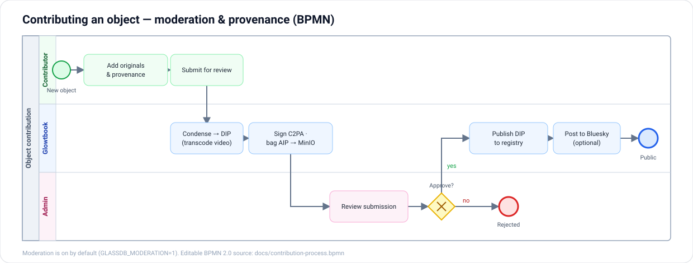

# Glass Database

[](https://github.com/alibama/glass-database/actions/workflows/ci.yml)
[](LICENSE)
[](#licensing)

An open, self-describing registry for the world of studio glass — studios,
artists, programs, events, and individual **objects** with real provenance.
It pairs a craft/registry side (who made what, where it is, what it's worth)
with a library/archive side (OAIS packaging, C2PA Content Credentials, an
ontology) so a piece of glass can carry a verifiable history.

Built to be **local-first and owned**: everything runs on plain SQLite and a
handful of small Python services. Point it at [Turso](https://turso.tech) and
the same files become a managed cloud DB — no rewrite.

> Runs in production at **[glassdatabase.org](https://glassdatabase.org)**.



---

## What's inside

Five small pieces share one database:

| Piece | What it is | Run on |
|---|---|---|
| **`central/`** | Self-describing SQLite store + a re-runnable spreadsheet importer | — |
| **`api/`** | Read-only, self-documenting HTTP API (FastAPI, `/docs`) | `:8000` |
| **`explore/`** | Public data explorer — break any dataset down, chart, map, download | `:8502` |
| **`admin/`** | Add content, moderate contributions, de-duplicate (basic-auth) | `:8501` |
| **`glowtbook/`** | Journal + object registry: AIP/DIP, C2PA signing, BagIt, Bluesky | `:8503` |

The API and explorer are **generic** — they read a registry (`_datasets` /
`_columns`) the importer builds, so every dataset is browsable without bespoke
code, and private columns (emails, phones, claim tokens) and restricted
datasets are withheld from public surfaces automatically.

## The provenance model (OAIS, in practice)

Contributing an object keeps the full-fidelity original **local** and sends a
condensed, public rendition to the registry:

- **AIP** (archival) — the untouched originals, wrapped as a **BagIt** bag with
  sha256 + sha512 fixity and a `metadata.json` (private value/insurance stays
  here), optionally pushed to **MinIO**/S3.
- **DIP** (dissemination) — downscaled images, a transcoded H.264 video + poster,
  and a C2PA-shaped manifest. Images are signed with **C2PA Content Credentials**
  so provenance travels *with* the file and verifies at
  [contentcredentials.org/verify](https://contentcredentials.org/verify) or
  [c2paviewer.com](https://c2paviewer.com).

Contributions are **moderated** by default (an admin approves before anything is
public) and can optionally be announced to **Bluesky** with the provenance image
attached. Full detail: [`deploy/PROVENANCE-ARCHITECTURE.md`](deploy/PROVENANCE-ARCHITECTURE.md).



The contribution flow above is also provided as editable BPMN 2.0 —
[`docs/contribution-process.bpmn`](docs/contribution-process.bpmn) — which opens
in [bpmn.io](https://bpmn.io), Camunda, or SpiffWorkflow.

## Quickstart

```bash
git clone https://github.com/alibama/glass-database.git
cd glass-database
python -m venv .venv && source .venv/bin/activate
pip install -r requirements.txt

make seed          # build a small synthetic demo database (no real data)
make run-api       # http://127.0.0.1:8000/docs
make run-explore   # http://127.0.0.1:8502
make run-glowtbook # http://127.0.0.1:8503
make run-admin     # http://127.0.0.1:8501
```

`make seed` writes a throwaway demo DB so every surface has something to show.
To load your own content, point the importer at a folder of spreadsheets:

```bash
python -m central.ingest build --uploads /path/to/folder-of-xlsx
```

Optional features degrade gracefully: **ffmpeg** enables video transcoding,
`c2pa-python` + `cryptography` enable Content Credentials, and the `MINIO_*`
env vars enable pushing AIP bags to object storage. Without them, video stays
archival-only, images publish unsigned, and bags are written locally.

## Deploy

A single web-server-aware installer provisions the whole stack behind Apache or
nginx with HTTPS, systemd units, and a service user:

```bash
sudo bash deploy/install.sh your-domain.org
```

It's idempotent and preserves your database, secrets, generated media, and
signing key across runs. See [`deploy/README-DEPLOY.md`](deploy/README-DEPLOY.md)
and [`deploy/AUTH.md`](deploy/AUTH.md).

## Tests

```bash
pip install pytest moto boto3 && make test
```

CI (`.github/workflows/ci.yml`) installs ffmpeg and runs the suite on every
push: data-cleaning, manifest shape, C2PA sign/read, BagIt validation, a
MinIO/S3 push against a mock server, video transcode, the API, and a load
smoke-test of all four apps.

## Project layout

```
central/     store + importer + shared DB connection
api/         read-only FastAPI service
explore/     public data explorer (Streamlit)   + dataclean.py (pure helpers)
admin/       content + moderation console (Streamlit)
glowtbook/   object registry: media, c2pa_sign, video, aip, bluesky
deploy/      installer, systemd units, reverse-proxy configs, architecture docs
scripts/     seed_demo.py (synthetic demo data)
tests/       pytest suite
docs/        additional documentation
```

## Licensing

- **Code** — [Apache License 2.0](LICENSE).
- **Data & the glass ontology** — [Creative Commons Attribution 4.0](https://creativecommons.org/licenses/by/4.0/) (CC-BY-4.0).

See [`CONTRIBUTING.md`](CONTRIBUTING.md) to get involved and
[`SECURITY.md`](SECURITY.md) to report a vulnerability.

## Acknowledgements

Built for the studio-glass community. The provenance work draws on
[C2PA](https://c2pa.org), [OAIS](https://www.iso.org/standard/57284.html),
[BagIt](https://datatracker.ietf.org/doc/html/rfc8493), and
[CIDOC-CRM](https://www.cidoc-crm.org/).
